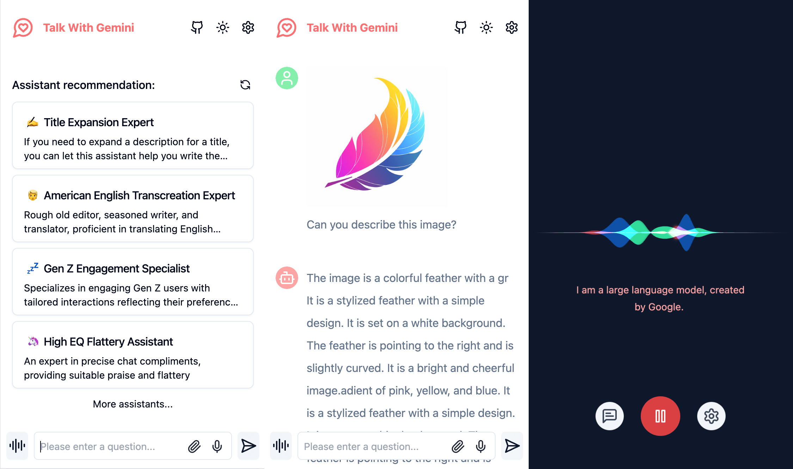
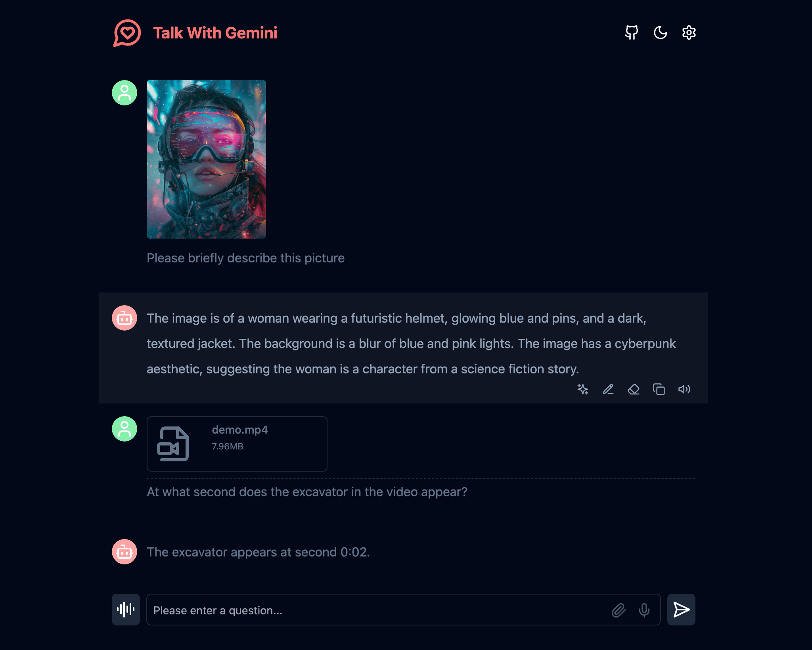
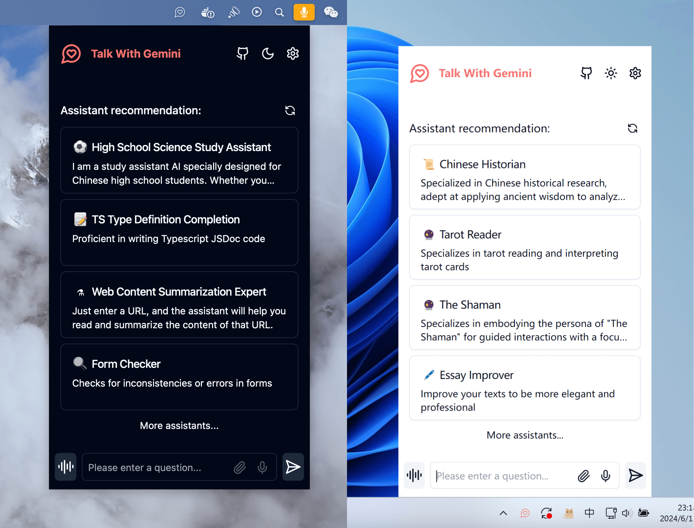

<div align="center">
<h1 align="center">Talk With Gemini</h1>


Deploy your private Gemini application for free with one click, supporting Gemini 1.5 Pro, Gemini 1.5 Flash, Gemini Pro and Gemini Pro Vision models.

一键免费部署您的私人 Gemini 应用, 支持 Gemini 1.5 Pro、Gemini 1.5 Flash、Gemini Pro 和 Gemini Pro Vision 模型。

[![Web][Web-image]][web-url]
[![MacOS][MacOS-image]][download-url]
[![Windows][Windows-image]][download-url]
[![Linux][Linux-image]][download-url]

[Web App][web-url] / [Desktop App][download-url] / [Issues](https://github.com/Amery2010/TalkWithGemini/issues)

[网页版][web-url] / [客户端][download-url] / [反馈](https://github.com/Amery2010/TalkWithGemini/issues)

[web-url]: https://gemini.u14.app/
[download-url]: https://github.com/Amery2010/TalkWithGemini/releases
[Web-image]: https://img.shields.io/badge/Web-PWA-orange?logo=microsoftedge
[Windows-image]: https://img.shields.io/badge/-Windows-blue?logo=windows
[MacOS-image]: https://img.shields.io/badge/-MacOS-black?logo=apple
[Linux-image]: https://img.shields.io/badge/-Linux-333?logo=ubuntu

[](https://vercel.com/new/clone?repository-url=https%3A%2F%2Fgithub.com%2FAmery2010%2FTalkWithGemini&project-name=talk-with-gemini&env=GEMINI_API_KEY&env=ACCESS_PASSWORD&repository-name=talk-with-gemini)

[](https://gitpod.io/#https://github.com/Amery2010/TalkWithGemini)



Simple interface, supports image recognition and voice conversation

简洁的界面，支持图片识别和语音对话



Supports Gemini 1.5 and Gemini 1.5 Flash multimodal models

支持 Gemini 1.5 和 Gemini 1.5 Flash 多模态模型



A cross-platform application client that supports a permanent menu bar, doubling your work efficiency

跨平台的应用客户端，支持常驻菜单栏，让您的工作效率翻倍

</div>

> Note: If you encounter problems during the use of the project, you can check the known problems and solutions of [FAQ](#FAQ).

> 注意：如果您项目使用过程中遇到问题，可以查看[常见问题](#常见问题)的已知问题及解决方案。

## Features

- **Deploy for free with one-click** on Vercel in under 1 minute
- Provides a very small (~5MB) cross-platform client (Windows/MacOS/Linux), can stay in the menu bar to improve office efficiency
- Supports multi-modal models and can understand images, videos, audios and some text documents
- Talk mode: Let you talk directly to Gemini
- Visual recognition allows Gemini to understand the content of the picture
- Assistant market with hundreds of selected system instruction
- Full Markdown support: LaTex formulas, code highlighting, and more
- Automatically compress contextual chat records to save Tokens while supporting very long conversations
- Privacy and security, all data is saved locally in the user's browser
- Support PWA, can run as an application
- Well-designed UI, responsive design, supports dark mode
- Extremely fast first screen loading speed, supporting streaming response
- Static deployment supports deployment on any website service that supports static pages, such as Github Page, Cloudflare, Vercel, etc.
- Multi-language support: English、简体中文、繁体中文、日本語、한국어、Español、Deutsch、Français、Português、Русский and العربية

## 主要功能

- 在 1 分钟内使用 Vercel **免费一键部署**
- 提供体积极小（~4MB）的跨平台客户端（Windows/MacOS/Linux），可以常驻菜单栏，提升办公效率
- 支持多模态模型，可以理解图片、视频、音频和部分文本文档
- 语音模式：让您直接与 Gemini 对话
- 视觉识别，让 Gemini 可以看懂图片内容
- 助理市场，拥有数百精选的系统指令
- 完整的 Markdown 支持：LaTex 公式、代码高亮等等
- 自动压缩上下文聊天记录，在节省 Token 的同时支持超长对话
- 隐私安全，所有数据保存在用户浏览器本地
- 支持 PWA，可以以应用形式运行
- 精心设计的 UI，响应式设计，支持深色模式
- 极快的首屏加载速度，支持流式响应
- 静态部署，支持部署在任何支持静态页面的网站服务，比如 Github Page、Cloudflare、Vercel 等
- 多国语言支持：English、简体中文、繁体中文、日本語、한국어、Español、Deutsch、Français、Português、Русский 以及 العربية

## Roadmap

- [x] Reconstruct the topic square and introduce Prompt list
- [x] Use tauri to package desktop applications
- [ ] Implementation based on functionCall plug-in
- [ ] Support conversation list

## 开发计划

- [x] 重构话题广场，引入 Prompt 列表
- [x] 使用 tauri 打包桌面应用
- [ ] 实现基于 functionCall 插件
- [ ] 支持对话列表

## Get Started

1. Get [Gemini API Key](https://aistudio.google.com/app/apikey)
2. Click
   [](https://vercel.com/new/clone?repository-url=https%3A%2F%2Fgithub.com%2FAmery2010%2FTalkWithGemini&project-name=talk-with-gemini&env=GEMINI_API_KEY&env=ACCESS_PASSWORD&repository-name=talk-with-gemini)
3. Start using

## 开始使用

1. 获取 [Gemini API Key](https://aistudio.google.com/app/apikey)
2. 单击
   [](https://vercel.com/new/clone?repository-url=https%3A%2F%2Fgithub.com%2FAmery2010%2FTalkWithGemini&project-name=talk-with-gemini&env=GEMINI_API_KEY&env=ACCESS_PASSWORD&repository-name=talk-with-gemini)
3. 开始使用

### Updating Code

If you want to update instantly, you can check out the [GitHub documentation](https://docs.github.com/en/pull-requests/collaborating-with-pull-requests/working-with-forks/syncing-a-fork) to learn how to synchronize a forked project with upstream code.

You can star or watch this project or follow author to get release notifications in time.

### 更新代码

如果你想立即更新，可以查看[GitHub文档](https://docs.github.com/en/pull-requests/collaborating-with-pull-requests/working-with-forks/syncing-a-fork)以了解如何将分叉项目与上游代码同步。

您可以关注该项目或关注作者以及时获取发布通知。

## Access Password

This project provides limited access control. Please add an environment variable named `ACCESS_PASSWORD` on the vercel environment variables page.

After adding or modifying this environment variable, please redeploy the project for the changes to take effect.

## 访问密码

项目提供访问控制。请在 `.env` 文件或环境变量页面添加名为 `ACCESS_PASSWORD` 的环境变量。

添加或修改此环境变量后，请重新部署项目以使更改生效。

## Custom model list

This project supports custom model lists. Please add an environment variable named `NEXT_PUBLIC_GEMINI_MODEL_LIST` in the `.env` file or environment variables page.

The default model list is represented by `all`, and multiple models are separated by `,`.

If you need to add a new model, please directly write the model name `all,new-model-name`, or use the `+` symbol plus the model name to add, that is, `all,+new-model-name`.

If you want to remove a model from the model list, use the `-` symbol followed by the model name to indicate removal, i.e. `all,-existing-model-name`. If you want to remove the default model list, you can use `-all`.

If you want to set a default model, you can use the `@` symbol plus the model name to indicate the default model, that is, `all,@default-model-name`.

## 自定义模型列表

本项目支持自定义模型列表。请在 `.env` 文件或环境变量页面添加名为 `NEXT_PUBLIC_GEMINI_MODEL_LIST` 的环境变量。

默认模型列表使用 `all` 表示，多个模型之间使用 `,` 分隔。

如果需要增加新的模型请直接写入模型名称 `all,new-model-name`，或使用 `+` 符号加上模型名称表示增加，即 `all,+new-model-name`。

如果要移除模型列表中的某个模型，请使用 `-` 符号加上模型名称表示移除，即 `all,-existing-model-name`。如果要移除默认模型列表，可以用 `-all` 表示。

如果要设定默认模型，可以使用 `@` 符号加上模型名称表示默认模型，即 `all,@default-model-name`。

## Environment Variables

### `GEMINI_API_KEY` (optional)

Your Gemini api key. If you need to `enable` the server api, this is required.

### `GEMINI_API_BASE_URL` (optional)

> Default: `https://generativelanguage.googleapis.com`

> Examples: `http://your-gemini-proxy.com`

Override Gemini api request base url. **To avoid server-side proxy url leaks, links in front-end pages will not be overwritten. **

### `GEMINI_UPLOAD_BASE_URL` (optional)

> Default: `https://generativelanguage.googleapis.com`

> Example: `http://your-gemini-upload-proxy.com`

Override Gemini file upload api base url. **To avoid server-side proxy url leaks, links in front-end pages will not be overwritten. **

### `NEXT_PUBLIC_GEMINI_MODEL_LIST` (optional)

Custom model list, default: all.

### `NEXT_PUBLIC_ASSISTANT_INDEX_URL` (optional)

> Default: `https://chat-agents.lobehub.com`

> Examples: `http://your-assistant-market-proxy.com`

Override assistant market api request base url. The api link in the front-end interface will be adjusted synchronously.

### `NEXT_PUBLIC_UPLOAD_LIMIT` (optional)

File upload size limit. There is no file size limit by default.

### `ACCESS_PASSWORD` (optional)

Access password.

### `HEAD_SCRIPTS` (optional)

Injected script code can be used for statistics or error tracking.

### `EXPORT_BASE_PATH` (optional)

Only used to set the page base path in [static deployment](#static-deployment) mode.

## 环境变量

### `GEMINI_API_KEY`（可选）

您的 Gemini api 密钥。 如果您需要“启用”服务器 api，这是必需的。

### `GEMINI_API_BASE_URL`（可选）

> 默认值：`https://generativelanguage.googleapis.com`

> 示例：`http://your-gemini-proxy.com`

覆盖 Gemini api 请求基本 url。**为了避免服务端代理 url 泄漏，不会覆盖前端页面中的链接。**

### `GEMINI_UPLOAD_BASE_URL`（可选）

> 默认值：`https://generativelanguage.googleapis.com`

> 示例：`http://your-gemini-upload-proxy.com`

覆盖 Gemini 文件上传 api 基本 url。**为了避免服务端代理 url 泄漏，不会覆盖前端页面中的链接。**

### `NEXT_PUBLIC_GEMINI_MODEL_LIST`（可选）

自定义模型列表，默认为: all。

### `NEXT_PUBLIC_ASSISTANT_INDEX_URL`（可选）

> 默认值：`https://chat-agents.lobehub.com`

> 示例：`http://your-assistant-market-proxy.com`

覆盖助理市场 api 请求基本 url。会同步调整前端界面中的 api 链接。

### `NEXT_PUBLIC_UPLOAD_LIMIT`（可选）

文件上传大小限制。默认不限制文件大小。

### `ACCESS_PASSWORD`（可选）

访问密码。

### `HEAD_SCRIPTS` （可选）

用于注入的脚本代码可用于统计或错误跟踪。

### `EXPORT_BASE_PATH` （可选）

仅用于[静态部署](#静态部署)模式下设置页面基础路径。

## Requirements

NodeJS >= 18, Docker >= 20

## 最低要求

NodeJS >= 18，Docker >= 20

## Development

If you have not installed pnpm

```shell
npm install -g pnpm
```

```shell
# 1. install nodejs and yarn first
# 2. config local variables, please change `.env.example` to `.env` or `.env.local`
# 3. run
pnpm install
pnpm dev
```

## 开发

如果您没安装过 pnpm

```shell
npm install -g pnpm
```

```shell
# 1. 先安装nodejs和yarn
# 2. 配置本地变量，请将 `.env.example` 改为 `.env` 或 `.env.local`
# 3. 运行
pnpm install
pnpm dev
```

## Deployment

### Docker (Recommended)

> The Docker version needs to be 20 or above, otherwise it will prompt that the image cannot be found.

> ⚠️ Note: Most of the time, the docker version will lag behind the latest version by 1 to 2 days, so the "update exists" prompt will continue to appear after deployment, which is normal.

```shell
docker pull xiangfa/talk-with-gemini:latest

docker run -d --name talk-with-gemini -p 5481:3000 xiangfa/talk-with-gemini
```

You can also specify additional environment variables:

```shell
docker run -d --name talk-with-gemini \
   -p 5481:3000 \
   -e GEMINI_API_KEY=AIzaSy... \
   -e ACCESS_PASSWORD=your-password \
   xiangfa/talk-with-gemini
```

If you need to specify other environment variables, please add `-e key=value` to the above command to specify it.

Deploy using `docker-compose.yml`:

```shell
version: '3.9'
services:
   talk-with-gemini:
      image: xiangfa/talk-with-gemini
      container_name: talk-with-gemini
      environment:
         - GEMINI_API_KEY=AIzaSy...
         - ACCESS_PASSWORD=your-password
      ports:
         - 5481:3000
```

## 部署

### 容器部署（推荐）

> Docker 版本需要在 20 及其以上，否则会提示找不到镜像。

> ⚠️ 注意：docker 版本在大多数时间都会落后最新的版本 1 到 2 天，所以部署后会持续出现“存在更新”的提示，属于正常现象。

```shell
docker pull xiangfa/talk-with-gemini:latest

docker run -d --name talk-with-gemini -p 5481:3000 xiangfa/talk-with-gemini
```

您也可以指定额外的环境变量：

```shell
docker run -d --name talk-with-gemini \
   -p 5481:3000 \
   -e GEMINI_API_KEY=AIzaSy... \
   -e ACCESS_PASSWORD=your-password \
   xiangfa/talk-with-gemini
```

如果您需要指定其他环境变量，请自行在上述命令中增加 `-e 环境变量=环境变量值` 来指定。

使用 `docker-compose.yml` 部署：

```shell
version: '3.9'
services:
   talk-with-gemini:
      image: xiangfa/talk-with-gemini
      container_name: talk-with-gemini
      environment:
         - GEMINI_API_KEY=AIzaSy...
         - ACCESS_PASSWORD=your-password
      ports:
         - 5481:3000
```

### Static Deployment

You can also build a static page version directly, and then upload all files in the `out` directory to any website service that supports static pages, such as Github Page, Cloudflare, Vercel, etc..

```shell
pnpm build:export
```

If you deploy the project in a subdirectory and encounter resource loading failures when accessing, please add `EXPORT_BASE_PATH=/path/project` in the `.env` file or variable setting page.

### 静态部署

您也可以直接构建静态页面版本，然后将 `out` 目录下的所有文件上传到任何支持静态页面的网站服务，比如 Github Page、Cloudflare、Vercel 等。

```shell
pnpm build:export
```

如果您将项目部署在子目录下，在访问时会遇到资源加载失败的情况，请在 `.env` 文件或者变量设置页面增加 `EXPORT_BASE_PATH=/路径/项目名称`。

## FAQ

#### ~~About the solution that vercel and netlify agents cannot upload large files~~

~~The currently known vercel and netlify both use serverless edge computing. Although the response speed is fast, they have size restrictions on uploaded files. Cloudflare Worker has relatively loose limits on large files (500MB for free users, 5GB for paid users) and can be used as an api proxy. [How to deploy the Cloudflare Worker api proxy](/docs/How-to-deploy-the-Cloudflare-Worker-api-proxy.md)~~

#### Why can’t I upload common documents such as doc, excel, and pdf?

Currently, the two models `Gemini 1.5 Pro` and `Gemini 1.5 Flash` support most images, audios, videos and some text files. For details, see [Support List](https://ai.google.dev/gemini-api/docs/prompting_with_media). For other document types, we will try to use [LangChain.js](https://js.langchain.com/v0.2/docs/introduction/) later.

## 常见问题

#### “User location is not supported for the API use” 的解决方案

可以参考以下两个 Gemini Api 代理项目 [gemini-proxy](https://github.com/Jazee6/gemini-proxy) 和 [palm-netlify-proxy](https://github.com/Amery2010/palm-netlify-proxy) 的部署方式。

**注意 Vercel 和 Netlify 禁止用户部署代理服务，该解决方案可能会导致封号，需谨慎使用**

#### ~~关于 vercel 与 netlify 代理无法上传大文件的解决方案~~

~~目前了解到的 vercel 与 netlify 都使用了无服务器的边缘计算，虽然响应速度快，但对于上传文件有大小限制。Cloudflare Worker 对于大文件限制（免费用户 500MB，收费用户 5GB）相对宽松，可以用做 api 代理。[如何部署 Cloudflare Worker api 代理](/docs/How-to-deploy-the-Cloudflare-Worker-api-proxy.md)~~

#### ~~关于无法使用语音对话功能的问题须知~~

~~目前语音识别使用的是浏览器的 SpeechRecognition 接口，系统会在[部分不支持 SpeechRecognition 接口的浏览器](https://caniuse.com/?search=SpeechRecognition)中**隐藏语音对话功能**。~~

~~由于大部分基于 Chrome 内核的浏览器在 SpeechRecognition 接口的实现上使用了 Google 的语音识别服务，因此需要能够正常访问国际网络的情况下使用。~~

#### 为什么我无法上传 doc、excel、pdf 这类常见文档

目前 `Gemini 1.5 Pro` 和 `Gemini 1.5 Flash` 这两个模型支持的大部分的图片、音频、视频和部分文本类的文件，详见[支持列表](https://ai.google.dev/gemini-api/docs/prompting_with_media)。对于其他文档类型，后续将尝试使用 [LangChain.js](https://js.langchain.com/v0.2/docs/introduction/) 来实现。

### 为什么我用 vercel 一键部署后的网站无法在中国正常访问

vercel 部署后生成的域名在几年前就已经被国内网络屏蔽，但并没有屏蔽服务器的 ip 地址。可以自定义域名，就可以在国内正常访问了。由于 vercel 在国内并没有服务器，所以有时候会出现些许的网络波动，属于正常现象。如何设置域名，可以参考我从网上找到的解决文章[Vercel绑定自定义域名](https://docs.tangly1024.com/article/vercel-domain)。

## Star History

[](https://star-history.com/#Amery2010/TalkWithGemini&Date)

## LICENSE

[GPL-3.0-only](https://opensource.org/license/gpl-3-0)
